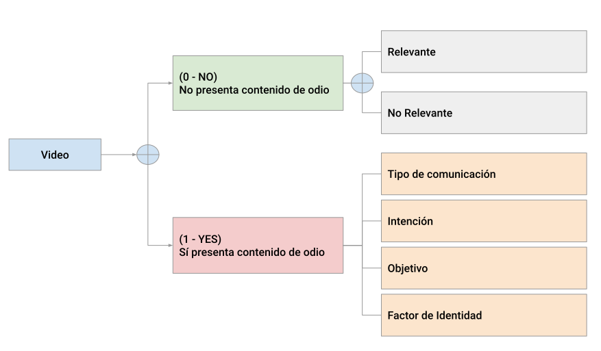

# Guía de annotación de _dataset_ de videos para la tarea de detección de discurso de odio

- [Información general](#información-general)
  - [Definición de Discurso de Odio](#definición-de-discurso-de-odio)
- [El video NO presenta contenido de odio](#el-video-no-presenta-contenido-de-odio)
- [El video SÍ presenta contenido de odio](#el-video-sí-presenta-contenido-de-odio)
  - [Tipo de Comunicación](#tipo-de-comunicación)
  - [Intención](#intención)
  - [Objetivo](#objetivo)
  - [Factor](#factor) 
- [Notas Importantes](#notas-importantes)
- [Contacto](#contacto)

## Información general
Una vez en la plataforma de etiquetado se te mostrarán videos de aproximadamente 1 minuto de longitud. Cada video se reproducirá automáticamente y al finalizar podrás repetirlo si gustas.

A continuación se te harán algunas preguntas acerca del contenido del video. De manera general, es importante que marques si el video presenta o no contenido de odio. Las demás preguntas son para complementar la información a partir de esta primera respuesta. 

Entonces a manera general el esquema de la guía de etiquetado es el siguiente:

### Definición de Discurso de Odio
De acuerdo con la Organización de las Naciones Unidas se considera [**discurso de odio**](https://www.un.org/en/hate-speech/understanding-hate-speech/what-is-hate-speech) a _"cualquier forma de comunicación en el habla, escrita o por comportamiento, que ataca o utiliza lenguaje discriminatorio o despectivo hacia una persona o grupo basado en su identidad, en otras palabras, basado en factores como su religión, etnicidad, nacionalidad, raza, color, descendencia, género u otros factores asociados a su identidad."_ (United Nations, n.d.)

De la definición rescatamos 4 aspectos importantes a considerar, el tipo de comunicación, la intención, el objetivo, y los factores/categorías asociadas a la identidad. Más adelante se detallará el rol de éstos cuando el video SÍ presenta contenido de odio.

## El video NO presenta contenido de odio
En caso de que el video NO presente contenido de discurso de odio se te preguntará si es relevante o no.
- **Relevante**
  - Todo aquel video en el que directa o indirectamente se perciba a alguien dando una opinión o a un grupo de personas interactuando 
- **No Relevante** 
  - Es un video que únicamente muestra una imagen de fondo y música instrumental
  - Es un video en lenguaje diferente al español

## El video SÍ presenta contenido de odio
En caso de que el video SÍ presente contenido de discurso de odio se te preguntarán algunos aspectos relacionados a la "Definición de Discurso de Odio" mostrada anteriormente. Intenta llenar el formulario con la máxima información posible de lo que percibas.
Estos aspectos son:
- Tipo de Comunicación
- Intención
- Objetivo
- Factor/Características

### Tipo de Comunicación
En este caso se toman en cuenta las siguientes formas de comunicar un mensaje:
- **Comunicación Verbal** (p. ej. narraciones, expresiones, conversaciones, entrevistas)
- **Comunicación No Verbal** (p. ej. lenguaje corporal, gestos, expresiones faciales)
- **Comunicación Visual** (p. ej. imágenes, símbolos)
- **Comunicación Textual** (p. ej. _posters_, subtítulos)
- **Comunicación en Masa** (p. ej. mensaje con el objetivo de informar a una audiencia, noticieros)
En este punto una o más formas de comunicación pueden ser percibidas.

### Intención
La **intención** se refiere al propósito del mensaje o acción percibida. En este caso se considera:
- **Ataque físico**
- **Expresión de descontento y/o desaprobación**
- **Expresión humorística**
En este punto una o más intenciones pueden ser percibidas.

### Objetivo
En este caso el **objetivo** determina si el mensaje va dirigido hacia un **grupo** o hacia una persona en particular (**individuo**). 

### Factor
En este caso el factor y/o características hacen referencia la "razón" del contenido del mensaje. Entonces estos factores están relacionados con la **identidad** de hacia quién va dirigido el mensaje. Por ejemplo:
- **Discriminación**
- **Misoginia**
- **Violencia**
En este punto uno o más factores de identidad pueden ser percibidos.

De acuerdo con la ["Guía de lenguaje incluyente y no sexista"](https://www.gob.mx/sre/documentos/guia-de-lenguaje-incluyente-y-no-sexista?state=published) de la SRE, algunos de los conceptos se definen como:

| Concepto | Definición |
|----------|----------|
| Discriminación    | **Toda distinción, exclusión o restricción que**, basada en el origen étnico o nacional, sexo, edad, discapacidad, condición social o económica, condiciones de salud, embarazo, lengua, religión, opiniones, preferencias sexuales, estado civil o cualquier otra, **tenga por efecto impedir o anular el reconocimiento o el ejercicio de los derechos y la igualdad real de oportunidades de las personas**. |
| Misoginia    | Cualquier **conducta de odio hacia la mujer** que se manifiesta en actos violentos y crueles contra ella por el hecho de ser mujer. |
| Violencia    | **Cualquier acción u omisión que cause daño o sufrimiento** psicológico, físico, patrimonial, económico, sexual o la muerte, y que se puede presentar tanto en el ámbito privado como en el público |

Para este caso tomamos tres factores como referencia. Sin embargo, si percibieras algún otro agradeceríamos nos lo indicaras en la sección de comentarios.

# Notas Importantes
- No olvides presionar el botón `Guardar y Continuar` cada vez que termines de etiquetar un video, de lo contrario el etiquetado de ese video no quedará guardado.
- Es posible `Cerrar sesión` y volver a etiquetar más tarde, tu progreso será guardado para que cuando vuelvas a `Iniciar sesión` retomes desde guardaste la última vez.
- Al momento de `Iniciar Sesión` se te asignó un cierto número de videos, así que cuando acabes de etiquetar (en caso de que aún tengamos videos disponibles) podrás decidir si gustas etiquetar otro conjunto de videos o no.

# Contacto
En caso de cualquier duda y/o problema escribe al correo.
📧: itzel.tlelo@gmail.com
